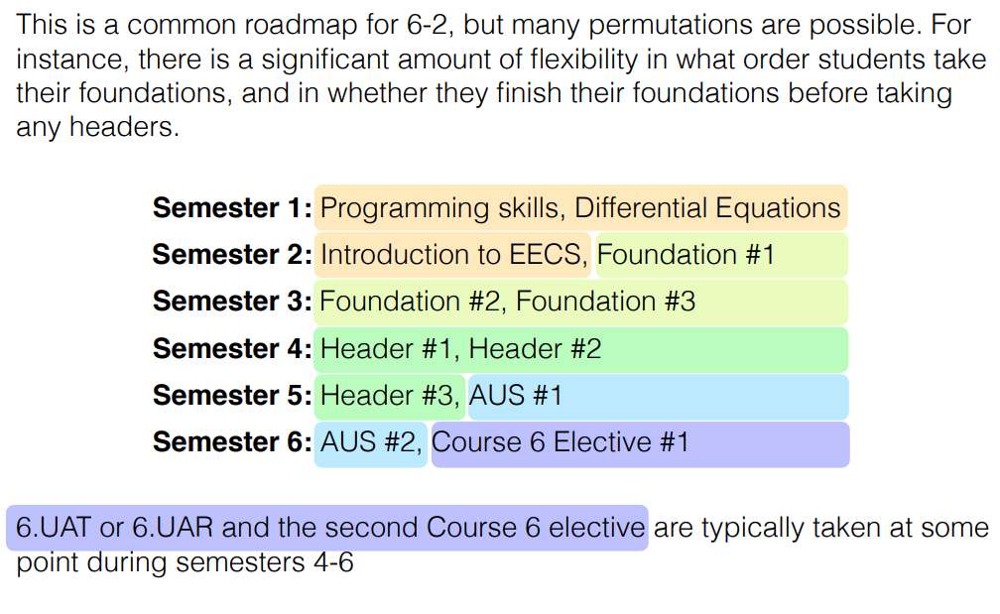

<h3 align="center">MIT EECS</h3>

  <strong>Major: 6-2 Electrical Engineering and Computer Science</strong>

  Path to a free self-taught education in the MIT OpenCourseWare!

    
  
  

# Overview

Open source plan for following the MIT Electrical Engineering and Computer Science curriculum 6-2 Electrical Engineering and Computer Science as closely as possible using MIT OCW and freely available resources. For self learners that are interested in what it could be like to attend MIT, but were unable to attend due to its the extremely selective nature.

There are multiple majors within the EECS department that also include majors more focused on theoretical computer science, or biological systems. This program outline is for 6-2. Feel free to add submodules for the other majors.

Curriculum overviews: <https://www.eecs.mit.edu/academics/undergraduate-programs/curriculum/>

# Core Classes

 </img>

## Year Zero

Year zero classes are the classes that would usually be completed during high school. Some of these classes are completed at MIT.

⚠️**DO NOT SKIP THESE COURSES IF**⚠️

If you have not taken these classes before or do not feel like you have a solid understanding of the subjects, start at the beginning and work your way up. These are critical to for understanding the fundamental concepts and fully grasping the ideas discusses in the more advanced year one courses. You will quickly lose motivation if you can't comprehend the subject matter.

These courses are not "easy" and depending on your existing knowledge, you may need to go back to the very beginning in fundamental algebra, biology, and physics, which is nothing to be ashamed of.

| Mathematics                                            | Course       | Description                                                                                     |
| ------------------------------------------------------ | ------------ | ----------------------------------------------------------------------------------------------- |
| Pre-calculus Courses                                   | Khan Academy | Khan academy is a fantastic resource for receiving a fundamentals education in various topics.  |
| Single Variable Calculus (Differentials and Integrals) | Khan Academy | Continue with Khan academy or switch to the much more rigorous MIT courses if you feel prepared |
| Multivariable calculus (Calculus II)                   | MIT OCW      | GIR                                                                                             |

# Year One

## Semester 1 (4 months)

Highlighted courses are the ones that I have personally selected.

| Subject                               | Course                               | Description                                  |
| ------------------------------------- | ------------------------------------ | -------------------------------------------- |
| Programming Skills                    | <mark>One of 6.0001\*</mark>, 6.S061 | The first introduction to programming course |
| <mark>Physics I\*</mark>              | MIT OCW                              | The first introductory physics course        |
| <mark>Differential Equations\*</mark> | MIT OCW                              | Mathematics for EE                           |

## Semester 2 (4 months)

| Physics                   | Course  | Description                            |
| ------------------------- | ------- | -------------------------------------- |
| <mark>Physics II\*</mark> | MIT OCW | The second introductory physics course |

| EECS                                | Course  | Description |
| ----------------------------------- | ------- | ----------- |
| <mark>Introduction to EECS\*</mark> | MIT OCW | Intro       |

| Foundation                                                                                    | Course  | Description                    |
| --------------------------------------------------------------------------------------------- | ------- | ------------------------------ |
| 6.1010 [6.009], 6.1210 [6.006], 6.1910 [6.004], 6.2000[6.002], 6.3000 [6.003], 6.3800 [6.008] | MIT OCW | Pick 1 of 3 foundation courses |

## Year Two

### Semester 3 (4 months)

| Foundation                                                                                    | Course  | Description                    |
| --------------------------------------------------------------------------------------------- | ------- | ------------------------------ |
| 6.1010 [6.009], 6.1210 [6.006], 6.1910 [6.004], 6.2000[6.002], 6.3000 [6.003], 6.3800 [6.008] | MIT OCW | Pick 2 of 3 foundation courses |

| Foundation                                                                                    | Course  | Description                    |
| --------------------------------------------------------------------------------------------- | ------- | ------------------------------ |
| 6.1010 [6.009], 6.1210 [6.006], 6.1910 [6.004], 6.2000[6.002], 6.3000 [6.003], 6.3800 [6.008] | MIT OCW | Pick 3 of 3 foundation courses |

## Year Three

## Year Four
